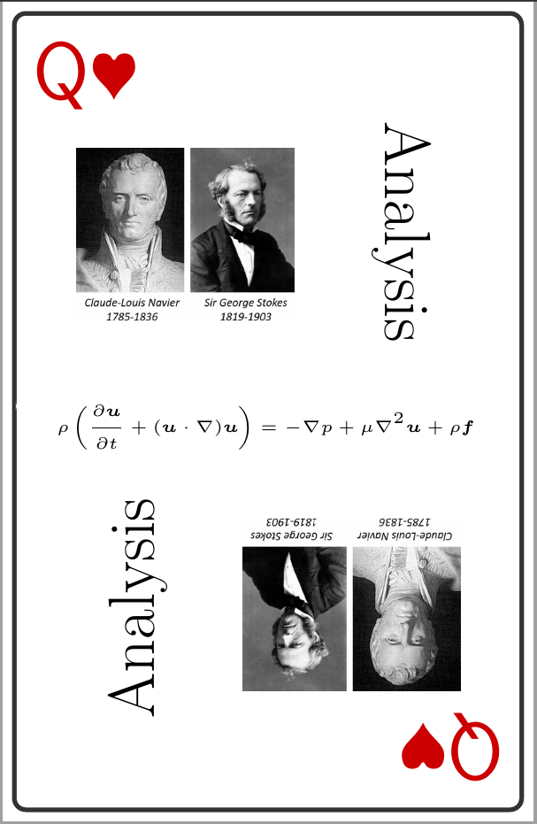

# latex-poker-painter
这是一个可以插入图片、文字、数学公式的，用于生成扑克牌卡面的LaTeX模板。

我的小红书账号：[失去理想的环](https://www.xiaohongshu.com/user/profile/64205834000000001102351e)

本repo中的代码是在 [使用 LaTeX 定制扑克牌--代码 - 晚来秋](https://www.xiaohongshu.com/discovery/item/68c7fd42000000001d006ae1?source=webshare&xhsshare=pc_web&xsec_token=ABIh3KB9Ev3wjlLDCyp8ei9MAqBjTM2Eon_0mILHnnUJY=&xsec_source=pc_share) 的基础上改进而来的。

我在这一版的主要改动如下：
1. 网格分割更细，使得外边框得以全部露出
2. 插入了图片和文字

待改进的不足之处：
1. 关于字体，我想使用\mathscr{}。（这个字体太戳我审美了）但是该字体下无法输出小写花体字母，昨晚我查遍资料也没有解决这个问题。。。
2. 可以考虑加入一些底纹做装饰
3. 扑克牌的背面还没设计

源码已在repo中，可随意取用，但请记得标注来源。

代码样例如下：

    
    

